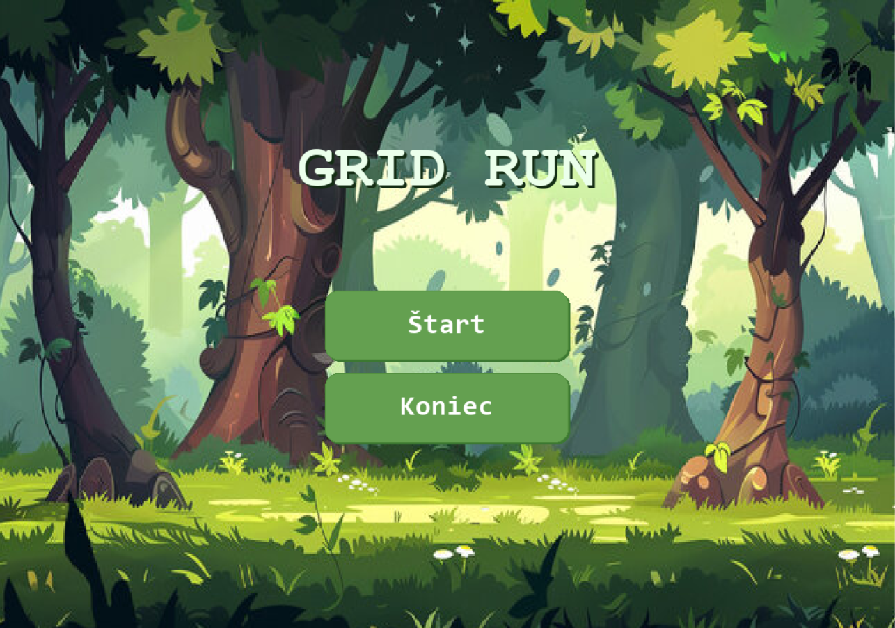
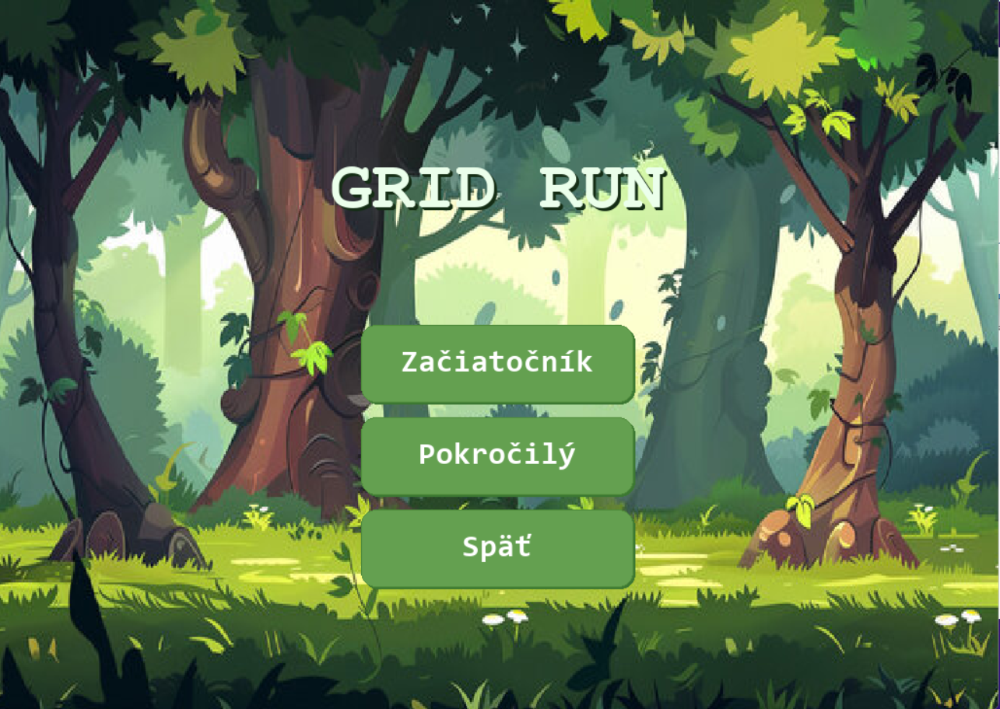
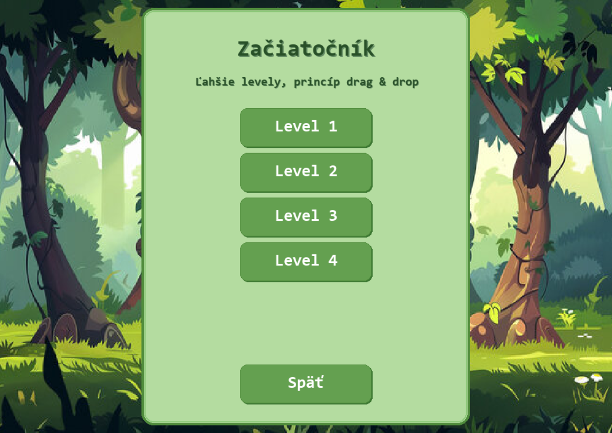
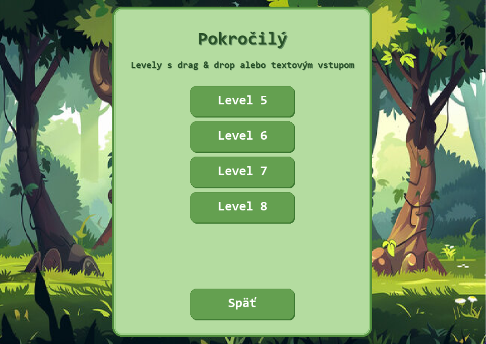
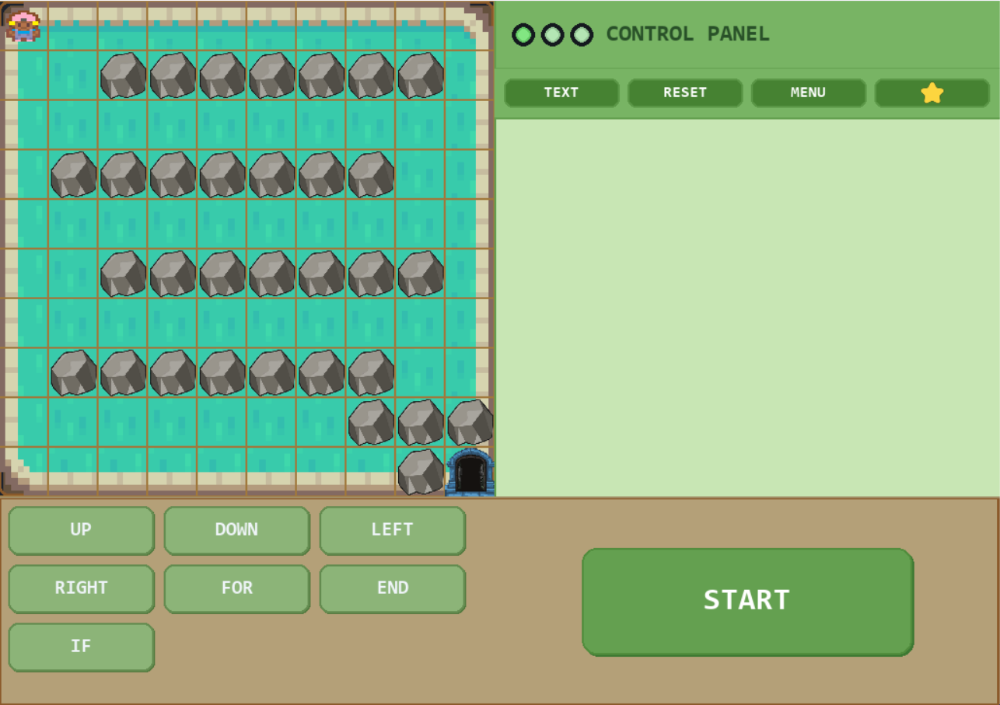

# GRID RUN

## O hre

**GRID RUN** je logická hra s prvkami programovania určená pre deti a začiatočníkov.  
Cieľom hry je doviesť postavičku k východu pomocou príkazov.

V **leveloch 1–4** hráč pracuje s príkazmi pomocou systému **drag & drop**. K dispozícii má základné pohybové príkazy a neskôr aj príkazy `FOR` a `IF`.  
V **leveloch 5–8** je dostupná aj **textová konzola**, pričom hráč môže prepínať medzi režimami **TEXT** a **DRAG**.

---

## Hlavné vlastnosti

- 8 ručne navrhnutých levelov s postupne rastúcou náročnosťou
- dva spôsoby zadávania príkazov:
  - **drag & drop panel** s blokmi príkazov
  - **textová konzola** v leveloch 5–8
- príkazy pre pohyb a jednoduché programové konštrukcie
- hodnotenie pomocou hviezdičiek podľa efektivity riešenia
- prehľadné používateľské rozhranie s tlačidlami **START**, **RESET**, **MENU** a informáciami o hodnotení
- záverečné okno po dokončení posledného levelu s možnosťou návratu do menu alebo ukončenia hry

---

## Herný princíp

Hráč sa snaží dostať postavičku cez mapu ku cieľu.  
Na tento účel skladá postupnosť príkazov, ktoré sa po stlačení tlačidla **START** vykonajú.

Počas hry sa hráč učí:

- plánovať postup riešenia
- používať príkazy v správnom poradí
- zjednodušovať riešenie pomocou opakovania (`FOR`)
- reagovať na prekážky pomocou podmienky (`IF`)
- porovnávať efektivitu riešení podľa počtu hviezdičiek

---

## Ovládanie

### Myš

- presúvanie príkazov v režime drag & drop
- klikanie na tlačidlá **START**, **RESET**, **MENU**
- prepínanie medzi režimami **TEXT** a **DRAG** v leveloch 5–8

### Klávesnica

V textovej konzole je možné zapisovať príkazy pomocou klávesnice.  
Používajú sa najmä tieto klávesy:

- **ENTER** – nový riadok
- **BACKSPACE** – zmazanie znaku pred kurzorom
- **DELETE** – zmazanie znaku za kurzorom

---

## Štruktúra levelov

### Levely 1–4
Tieto levely sú zamerané na skladanie riešenia pomocou blokov príkazov.

Hráč postupne pracuje s týmito príkazmi:

- `UP`
- `DOWN`
- `LEFT`
- `RIGHT`
- `FOR`
- `IF`

### Levely 5–8
V pokročilejších leveloch hra začína v **textovej konzole**.  
Hráč môže podľa potreby prepnúť na režim **DRAG** a následne späť na režim **TEXT**.

Tieto levely sú zamerané na kombinovanie:

- textového zápisu príkazov
- logického plánovania
- práce s opakovaním a podmienkami
- efektívneho riešenia mapy

---

## Podporované príkazy v textovej konzole

V textovej konzole sú podporované tieto príkazy:

- `up`
- `down`
- `left`
- `right`
- `for N`
- `end`
- `if obstacle <dir>`
- `break obstacle`

kde `<dir>` môže predstavovať smer:

- `up`
- `down`
- `left`
- `right`

---

## Hodnotenie

Hra obsahuje systém hodnotenia pomocou hviezdičiek.  
Počet získaných hviezdičiek závisí od efektivity riešenia konkrétneho levelu.

Pri hodnotení sa sledujú najmä:

- počet použitých príkazov
- počet resetov
- použitie vhodných konštrukcií, napríklad `FOR` a `IF`
- spôsob zadania riešenia v leveloch 5–8

V leveloch **5–8** platí:

- **3 hviezdičky** – riešenie bolo vytvorené len v textovom režime
- **2 hviezdičky** – bolo použité kombinované riešenie textového režimu a drag & drop
- **1 hviezdička** – riešenie bolo vytvorené len pomocou drag & drop

---

## Spustenie hry vo Windows

1. Otvor priečinok s hrou.
2. Otvor priečinok **dist**.
3. Spusť súbor **main.exe**.

Hra používa pevnú veľkosť okna, aby zostalo zachované správne rozloženie používateľského rozhrania.

